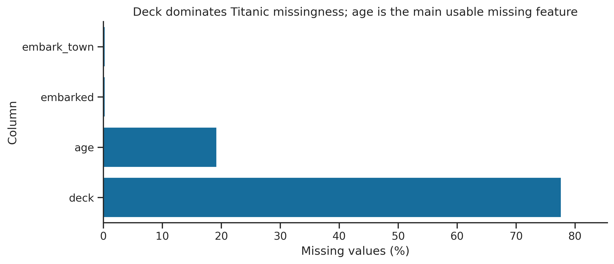
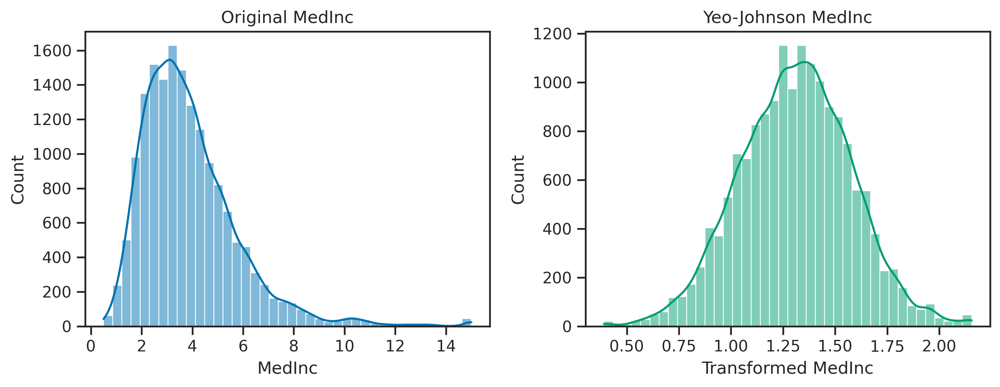

# From-Scratch ML Preprocessing

A compact machine-learning preprocessing toolkit implemented primarily with NumPy, accompanied by reproducible case studies on the Titanic and California Housing datasets.

The project focuses on understanding how common preprocessing algorithms work internally and how to apply them without data leakage.

## Highlights

- Mean and median imputation
- K-nearest-neighbour imputation using shared observed features
- One-hot encoding with unseen-category handling
- Smoothed target encoding with out-of-fold training support
- Standard, min-max, and robust scaling
- Polynomial and interaction feature generation
- Uniform and quantile-based discretisation
- Maximum-likelihood Yeo-Johnson power transformation
- Leakage-safe pipelines, cross-validation, and outlier treatment
- Automated tests and GitHub Actions continuous integration

## Case studies

### Titanic classification

The workflow analyses missingness, creates an age-missing indicator, performs training-only imputation and encoding, and evaluates a logistic-regression pipeline with stratified cross-validation.

**Saved-run result:** mean five-fold accuracy of **0.796 ± 0.025**.



### California Housing regression

The workflow compares raw standardised features, polynomial expansion, quantile binning, winsorisation, and a fitted Yeo-Johnson transformation.

| Feature representation | Mean CV RMSE |
|---|---:|
| Standardised raw features | 0.7205 |
| Degree-2 polynomial expansion | 1.3903 |
| Raw features + quantile-binned income | 0.7087 |
| Winsorised income | 0.7069 |



## Repository structure

```text
.
├── src/
│   └── ml_preprocessing/   # Reusable preprocessing implementations
├── notebooks/              # Executed end-to-end case study
├── tests/                  # Unit tests
├── examples/               # Minimal usage example
├── figures/                # Saved visualisations
├── .github/workflows/      # Automated test workflow
├── pyproject.toml
└── requirements.txt
```

## Installation

Python 3.11 or newer is recommended.

```bash
git clone https://github.com/YOUR-USERNAME/from-scratch-ml-preprocessing.git
cd from-scratch-ml-preprocessing

python -m venv .venv
```

Activate the environment:

```bash
# Windows PowerShell
.venv\Scripts\Activate.ps1

# macOS/Linux
source .venv/bin/activate
```

Install the project and analysis dependencies:

```bash
python -m pip install --upgrade pip
pip install -e ".[analysis,dev]"
```

## Usage

```python
import numpy as np

from ml_preprocessing import SimpleImputer, StandardScaler

X = np.array([
    [1.0, np.nan],
    [3.0, 10.0],
    [5.0, 14.0],
])

X_imputed = SimpleImputer(strategy="mean").fit_transform(X)
X_scaled = StandardScaler().fit_transform(X_imputed)
```

Run the full notebook:

```bash
jupyter notebook notebooks/preprocessing_case_studies.ipynb
```

The datasets are downloaded by seaborn and scikit-learn on the first run, so an internet connection is required when executing the notebook from a clean environment.

## Tests

```bash
pytest
```

## Design notes

- Fitted statistics are learned only from training data or the training portion of each cross-validation fold.
- The implementations intentionally prioritise readability and algorithmic transparency over production-level optimisation.
- Custom components are compared with scikit-learn behaviour where appropriate.
- Randomised operations use seed `42` for reproducibility.

## License

This project is available under the MIT License.
